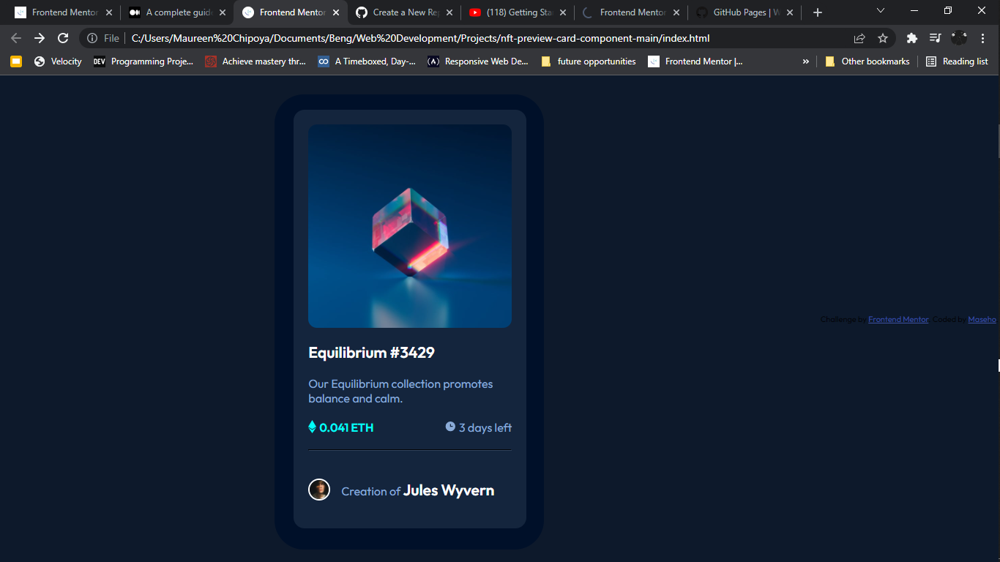

# Frontend Mentor - NFT preview card component solution

This is a solution to the [NFT preview card component challenge on Frontend Mentor](https://www.frontendmentor.io/challenges/nft-preview-card-component-SbdUL_w0U). Frontend Mentor challenges help you improve your coding skills by building realistic projects. 

## Table of contents

- [Overview](#overview)
  - [The challenge](#the-challenge)
  - [Screenshot](#screenshot)
  - [Links](#links)
  - [Built with](#built-with)
  - [What I learned](#what-i-learned)
  - [Continued development](#continued-development)
  - [Useful resources](#useful-resources)
- [Connect with me](#connect-with-me)

## Overview

### The challenge

Users should be able to:

- View the optimal layout depending on their device's screen size
- See hover states for interactive elements

### Screenshot




### Links

- Live Site URL: [nft-preview-card-component](https://maseho.github.io/nft-preview-card-component-main/)


### Built with

- Semantic HTML5 markup
- CSS

### What I learned
- I learnt how to use display and position in CSS.

### CSS code that I am proud of

```css

.eth.days{
    display: flex;
    align-items: center;
}
.eth img{
    position: absolute;
}
.eth p{
    color: hsl(178, 100%, 50%);
    font-weight: 600;
    padding-left: 15px;
}
.days img{
    position: absolute;
}
.days p{
    padding-left: 20px;
}
}
```


### Continued development

I want to learn javascript to make my websites more responsive. I also want to make Css animations


### Useful resources

- [CSSMatic](https://cssmatic.com) - This helped me with generating a box-shadow.


## Connect with me

- Frontend Mentor - [@Maseho](https://www.frontendmentor.io/profile/Maseho)
- Twitter - [@masxho](https://www.twitter.com/masxho)

